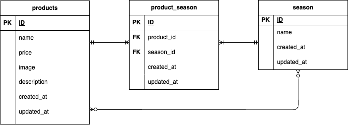

## 　 mogitate(基礎学習ターム確認テスト_もぎたて)

## 環境構築

このプロジェクトは Docker Compose を利用したコンテナ環境で動作します。

## 前提条件

*Docker / Docker Compose がインストールされていること。  
*Git がインストールされていること。

## セットアップ手順

リポジトリのクローン

```bash
git clone git@github.com:Ayana-del/Ayana-kadai2.git
```

```bash
cd Ayana-kadai2
```

コンテナの起動

```bash
docker-compose up -d --build
```

PHP コンテナのログインと初期設定

```bash
docker-compose exec php bash
```

依存パッケージのインストール

```bash
composer install
```

環境ファイルのコピー

```bash
cp .env.example .env
```

アプリケーションキーの生成

```bash
php artisan key:generate
```

## ER 図

テーブル使用に基づいて作成した ER 図を以下に示します。  


## ルーティング仕様

| 画面                   | HTTP メソッド | URL                          | 目的                                 | コントローラーメソッド |
| :--------------------- | :------------ | :--------------------------- | :----------------------------------- | :--------------------- |
| 商品一覧               | GET           | /products                    | 商品一覧を表示                       | index                  |
| 検索                   | GET           | /products/search             | 検索結果を表示                       | search                 |
| 商品登録画面           | GET           | /products/register           | 登録フォーム                         | create                 |
| 商品登録処理           | POST          | /products/register           | フォームをデータベースに保存         | store                  |
| 商品詳細・変更フォーム | GET           | /products/{productId}        | 特定の商品を表示・編集フォームを表示 | show                   |
| 商品更新処理           | PATCH         | /products/{productId}/update | 編集データをデータベースに反映       | update                 |
| 削除処理               | DELETE        | /products/{productId}/delete | 特定の商品を削除                     | destroy                |
  
## コントローラー仕様  
商品管理機能の中核を担うProductControllerに実装したメソッドと、その役割は以下の通りです。  
| メソッド名 | HTTPメソッド | URL | 役割 |  
| :---- | :---- | :---- | :---- |  
| index() | GET | /products |商品一覧表示。データベースから商品を取得し、ビューに渡す。 |  
| search(Request $request) | GET | /products/search | 商品検索処理。リクエストの検索条件に基づき、商品を絞り込んでindexビューへ渡す。 |  
| create() | GET | /products/register | 商品登録フォーム表示。フォームと共に、seasonsテーブルから季節の選択肢を取得しビューへ渡す。 |  
| store(Request $request) | POST | /products/register | 商品登録処理。バリデーション、画像バリデーション、画像アップロード、productsおよび、product_seasonテーブルへのデータ保存を行う。 |  
| show($productId) | GET | /products/{productId} | 商品詳細・変更フォーム表示。指定されたIDの商品と関連する季節情報を主と置くし、ビューへ渡す。|  
| update(Request $request,$productId) | PATCH | /products/{productId}/update | 商品更新処理。更新データのバリデーション、画像更新、データベースの更新を行う。 |  
| destroy($productId) | DELETE | /products/{productId}/delete | 商品削除処理。指定されたIDと、関連する中間テーブルのレコードを削除する。 |  
  
## データベース仕様  
商品管理機能のために定義し、マイグレーションを実行したテーブル構造は以下の通りです。  
1.productsテーブル（商品情報）  
| カラム名 | 型 | PRIMARY KEY | NOT NULL | 補足 |  
| :---- | :---- | :---- | :---- | :---- |  
| id | bigint unsigned | ◯ | ◯ | 主キー |  
| name | varchar(255) |  | ◯ | 商品名 |  
| price | int |  | ◯ | 商品料金 |  
| image | varchar(255) |  | ◯ | 商品画像パス |  
| description | text |  | ◯ | 商品説明 |  
| created_at | timestamp |  |  |  |  
| updated_at | timestamp |  |  |  |  
  
2.seasonsテーブル（季節情報）  
| カラム名 | 型 | PRIMARY KEY | NOT NULL | 補足 |  
| :---- | :---- | :---- | :---- | :---- |  
| id | bigint unsigned | ◯ | ◯ | 主キー |  
| name | varchar(255) |  | ◯ | 季節名 |  
| created_at | timestamp |  |  |  |  
| updated_at | timestamp |  |  |  |  
  
3.product_seasonテーブル（中間テーブル）  
| カラム名 | 型 | PRIMARY KEY | NOT NULL | FOREIGN KEY |  
| :---- | :---- | :---- | :---- | :---- |  
| id | bigint unsigned | ◯ | ◯ |  |  
| product_id | bigint unsigned |  | ◯ | products(id) |  
| season_id | bigint unsigned |  | ◯ | seasons(id) |  
| create_at | timestamp |  |  |  |  
| updated_at | timestamp |  |  |  |  
  
## モデル・リレーション仕様  
Eloquent ORMを使用し、以下の通りテーブル間の関連付けを定義しています。  
### Productモデル(APP\Models\Product)  
・多対多リレーション：seasons()  
　・product_season中間テーブルを介してSeasonモデルと関連づけられています。  
　・withTimestamps()を有効にしており、中間テーブルのcreated_at/updated_atを自動更新します。  
  
・一括割り当て制限($fillable):name,price,image,description  
### Seasonモデル(App\Models\Season)  
・多対多リレーション：products()  
　・product_sesason中間テーブルを介してProductモデルと関連づけられています。  
・一括割り当て制限($fillable):name

